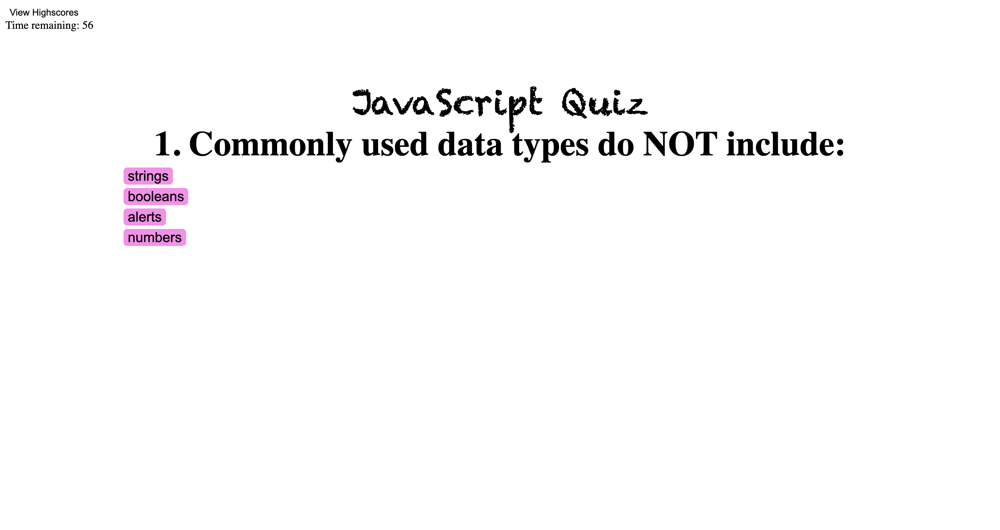

# JavaScript-Quiz

## Description

The JavaScript Quiz allows users to test their JavaScript knowledge and get the chance to log and keep track of highscores. This application is useful for use as a refresher or learning as a novice. It also makes learning a little fun by being timed and keeping track of your scores.

While building this application, I learned how to use local stoarage and incorporate a variety of functions that all work together.

## Usage

To use the JavaScript Quiz, you begin by clicking "Start Quiz". As you go through the questions, you will see the timer at the top of the screen go from 60 seconds to 0 seconds. If you incorrectly answer a question, you will have 10 seconds deducted from the timer. Each question is worth 20 points.

At the end of the quiz, you will be prompted to enter your initials to be stored with your high score. To see the high scores list, you can click on "View Highscores" in the top left corner to see them.

